# Jog Tracker

Jog Tracker is app build for jogger to keep track of daily progress and see aggregated statistics. The interface is clean, clear and is easy to use from the moment you first start using the app.

## Features

### Simple Sign Up

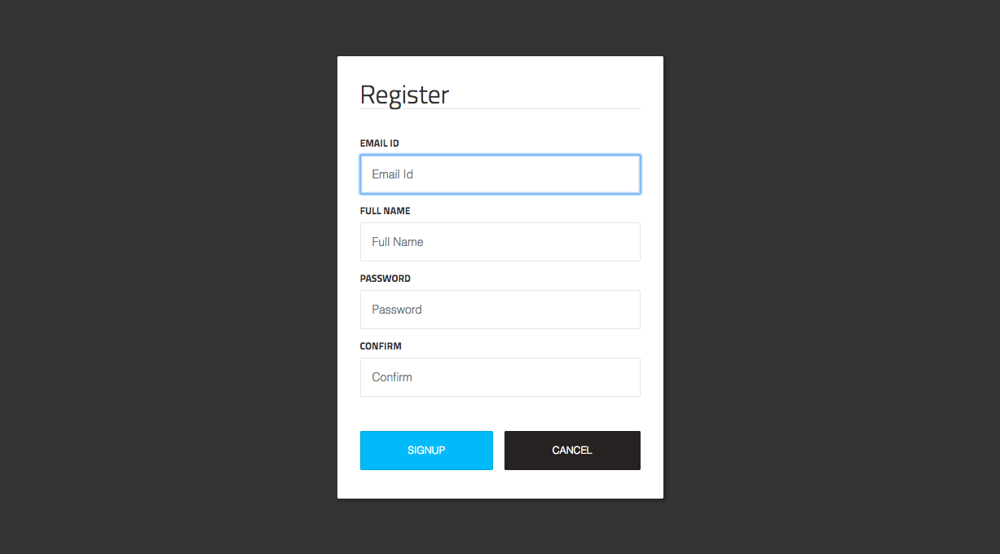

### Sign In

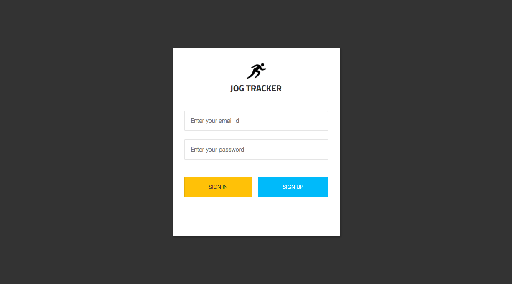

### Dashboard

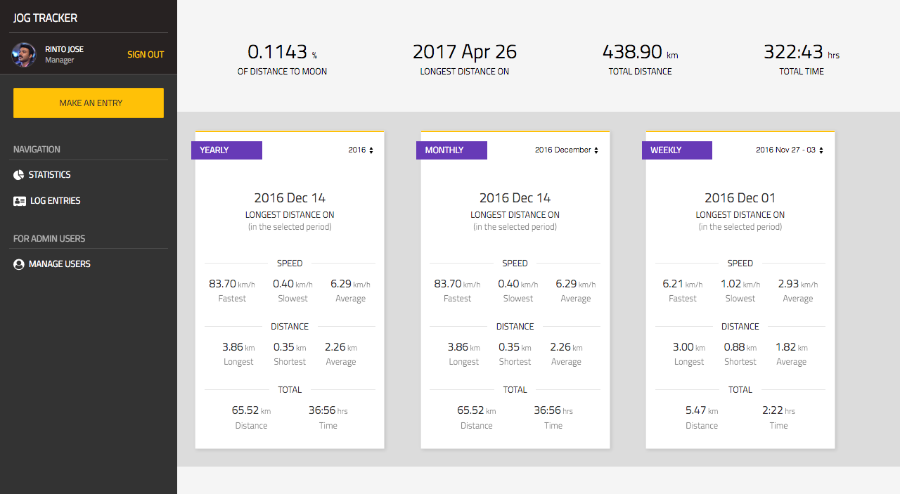

### Jog Logs

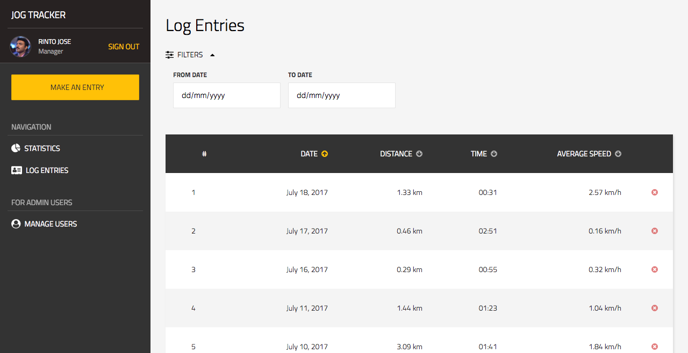

### Make An Entry

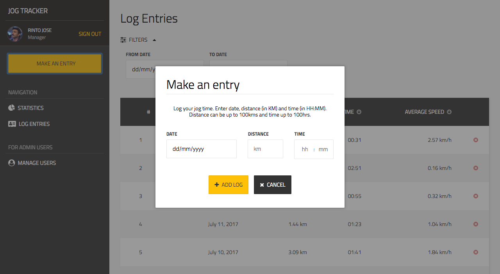

### Manage Users (Admin & Manager)

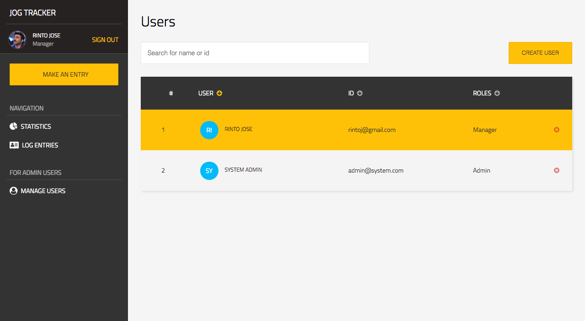

### Create User (Admin & Manager)

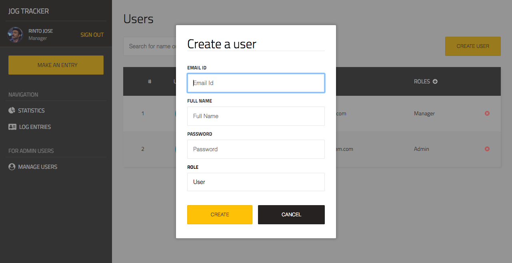

### Manage User's Log (Admin Only)

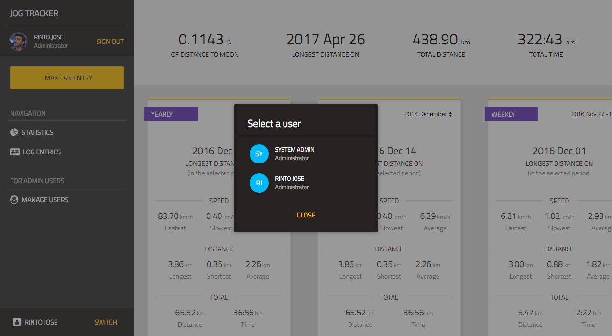

## Unit Tests - Front End

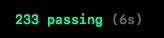
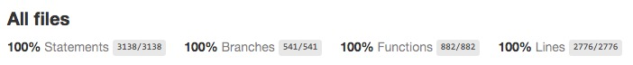

## Functional Tests - Back End

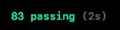

## Author

**Rinto Jose** (rintoj)

Read my blogs at [Medium.com](https://medium.com/@rintoj)

Follow me:
  [Github](https://github.com/rintoj)
| [Facebook](https://www.facebook.com/rinto.jose)
| [Twitter](https://twitter.com/rintoj)
| [Google+](https://plus.google.com/+RintoJoseMankudy)
| [Youtube](https://youtube.com/+RintoJoseMankudy)